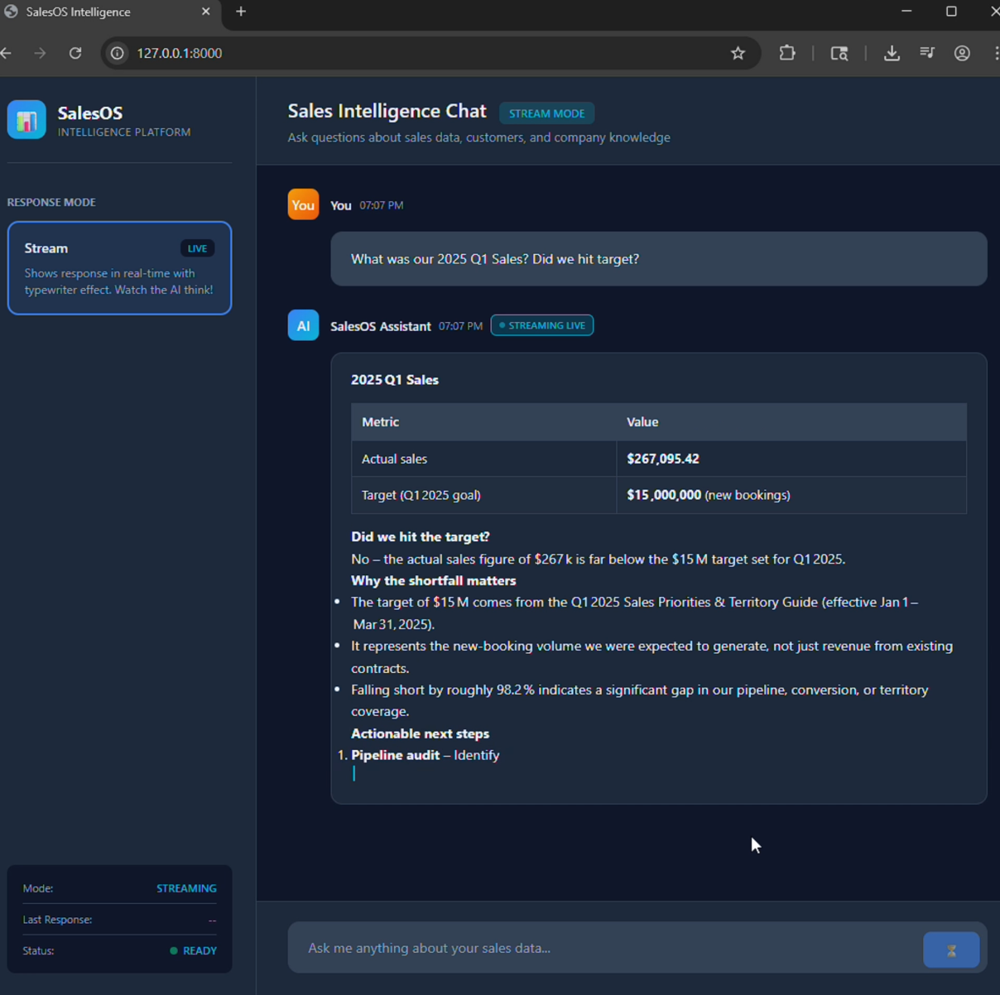
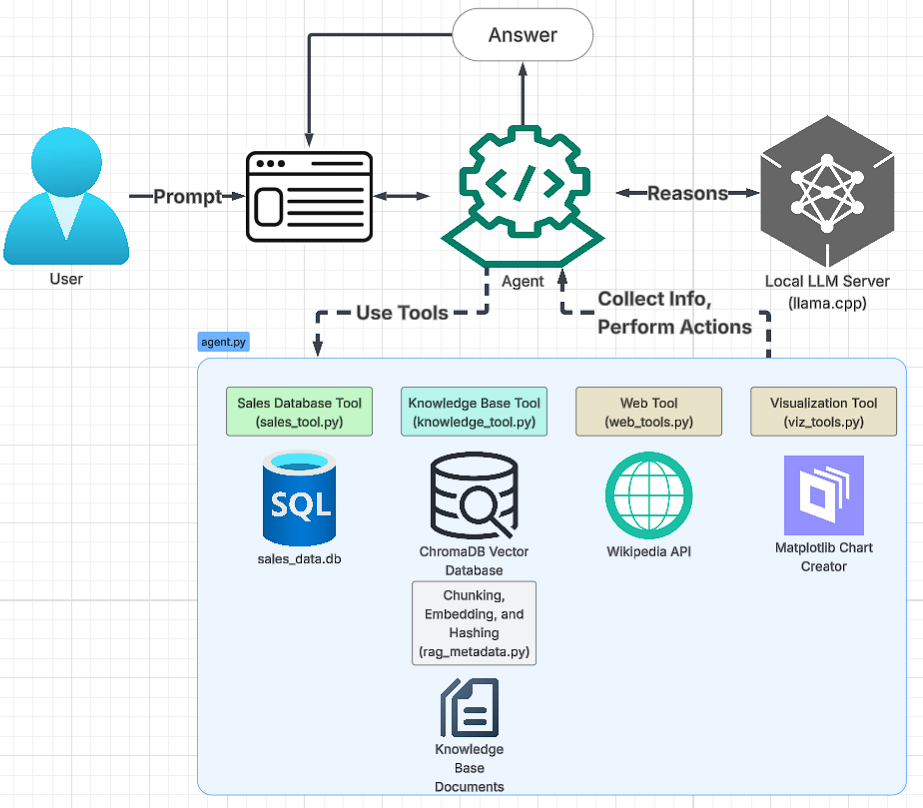

# SalesOS-Agent 

**Learn how AI agents can use multiple tools to answer questions by building a working sales assistant.**

**SalesOS-Agent** is an experimental AI-powered sales assistant built to explore how large language models can reason over databases, documents, and intelligent tools.

<p align="center">
  
</p>

It is a learning project that is built for local development that incorporates:
- smart SQL generation,
- retrieval of content,
- and agent decision-making  
into a simple assistant that can answer sales questions.

I built this to experiment, learn, and share ideas. If you're curious how concepts like RAG and SQL tools work together with an agent, this repo provides a basic implementation.

---

## How It Works: Step-by-Step 

<p align="center">
  
</p>

### 1. You Ask a Question 
```
User: "Did we hit our Q1 2025 sales target?"
```
The agent receives the prompt as plain text.

### 2. LLM Decides What Tools to Use
The agent sends the prompt and tool descriptions to the LLM. The LLM **reasons** about what information it needs: actual Q1 sales (database) and the Q1 goals (documents). The LLM outputs which tools to call and with what parameters.

### 3. Agent Calls the SQL Tool 
```python
@tool
def query_sales_database(question: str) -> str:
    # Agent passes: "What were Q1 sales?"
```
The agent decides to use the SQL tool first. The tool receives the question and generates a SQL query to get the actual sales number. The tool makes a second LLM call to generate the SQL.

### 4. SQL Generation 
```python
sql_query = _generate_sql_with_llm(question, schema)
# Generates for example: SELECT SUM(total_amount) FROM sales WHERE ...
```
The SQL tool asks the LLM to write the query based on the database schema. The schema is cached after the first call so it doesn't query the DB structure every time which works fine for a small local setup like this one.

### 5. Query Execution
```python
cursor.execute(sql_query)
results = cursor.fetchall()
# Returns: [{'total': 271680.50}]
```
The generated SQL runs against the SQLite database. 

### 6. Agent Calls the RAG Tool
```python
@tool
def search_local_docs(query: str) -> str:
    # Agent passes: "Q1 sales target"
```
The agent realizes it also needs the sales target, so it calls the document search tool. This tool uses RAG (Retrieval Augmented Generation) to find relevant info.

### 7. Vector Search (Semantic Similarity)
```python
docs = vectorstore.similarity_search_with_score(query, k=6)
```
Documents in the "kb/" folder were converted to **vector embeddings** (arrays of numbers that represent meaning) when you ran `setup_knowledge_base.py`. The query is also converted to a vector, then ChromaDB finds the "TOP_K" most similar document chunks using **vector distance**. In other words it measures how close vectors are in mathematical space, which corresponds to semantic similarity. The closer the distance between the points, the more they are similar.

### 8. Retrieval Augmented Generation (RAG) Returns Relevant Chunks
```
[Document 1] From: Q1_2025_Sales_Priorities.md (Score: 0.22)
Q1 2025 Company Goals

Revenue Targets

New Business Goal:** $12M  
Expansion Revenue (Upsells/Cross-sells) Goal: $3M  

**Total Q1 Target:** $15M
```
The tool returns the most relevant document sections with their similarity scores. Lower scores in this setup mean more relevant (closer in vector space). Some frameworks use cosine similarity where you typically want a value as close to 1 as possible for most relevant results.

### 9. Agent Synthesizes the Answer
```python
# Agent now has:
# - Actual sales: $271,680
# - Target: $15M
# Agent reasons about both pieces
```
The LLM combines both tool outputs to formulate a complete answer. It can do math, make comparisons, and provide context.

### 10. Response to User
```
A: Q1 sales were $271K vs target of $15M (1.8% of goal).
   You fell short by $14.73M.
```
The agent returns a synthesized answer that answers your original question. With the `viz_tool.py` the agent may create a graph from SQL data in your charts/ folder. 

---

## Core Components

### Agent 
The agent orchestrates everything, think of it as the main script. It reads tool descriptions, decides which tools to call, interprets results, and generates responses. Uses **conversation memory** to remember context within a session.

### Tools (Python Functions)
Python functions decorated with `@tool` that the agent can call. Each tool has a name, description, and parameters that the agent reads to decide when to use it. Tools return strings that the agent can reason about.

### SQL Tool (Text-to-SQL)
Takes a natural language question, generates SQL using an LLM, validates it (blocks DROP, DELETE, etc.), executes it on SQLite, and returns results. 

### RAG Tool (Vector Search)
Searches your company documents using semantic similarity. Documents are split into chunks (500 chars), converted to vectors (arrays of 384 numbers from `sentence-transformers/all-MiniLM-L6-v2`), and stored in ChromaDB. When you search, your query becomes a vector and ChromaDB finds the closest matching document vectors.

### Vector Database (ChromaDB)
Stores document embeddings and enables fast similarity search. Uses **HNSW algorithm** (Hierarchical Navigable Small World) to find nearest neighbors in high-dimensional space without comparing every single vector.

### Embeddings (Sentence Transformers)
Converts text to vectors. Similar meanings produce similar vectors. Example: "sales target" and "revenue goal" have close vectors even though they share no words. The model (`all-MiniLM-L6-v2`) was trained on millions of sentences to learn these semantic relationships.

### Visualization Tool
Tool that takes data (typically SQL results), converts to charts using Altair, and saves interactive html files. Demonstrates that that tools can be simple functions without LLM calls.

### System Prompt
Instructions that tell the agent how to use tools. Explains which tools have what data, gives examples of multi-tool workflows, and sets behavior guidelines. The agent follows these instructions but isn't perfect.

### Checkpointer (Memory)
Stores conversation history in RAM using `InMemorySaver`. Allows follow-up questions like "What about just Europe?" after asking about customers. Memory resets when you restart the program.

---

## Quick Start

You'll need:

- **Tested on Python 3.12.x, known dependency conflicts with 3.14+**
- An LLM with an OpenAI-compatible API (Ollama, llama.cpp, OpenAI, or other compatible providers etc.)
- Dependencies installed via pip

### 1. Clone the repo
```bash
git clone https://github.com/LokiJin/SalesOS-Agent
cd SalesOS-Agent
```

### 2. Install Python requirements
```bash
pip install -r requirements.txt
```

### 3. Choose Your LLM Server and Model

**3A. Start your LLM server**

**Local (Ollama - easiest)(llama.cpp - a great alternative):**
```bash
ollama pull gpt-oss:20b
ollama serve
```

**Or use cloud LLM provider via API:**
```bash
export OPENAI_API_KEY="sk-..."
```

**3B. Update `config.py`**

Open `config.py` review defaults and set:
- `LLM_ENDPOINT` - Your LLM server endpoint
  - Ollama: `http://localhost:11434/v1`
  - llama.cpp: `http://localhost:8080/v1`
  - OpenAI: `https://api.openai.com/v1`
- `MODEL_NAME` - Your model (e.g., `gpt-oss:20b` for local, `gpt-5.2` for cloud) 

### 4. Set Up Data
```bash
# Create fake sales database (200 customers, 500 transactions)
python setup_sales_db.py

# Add documents to kb/ folder or just use the existing ones

# Convert kb/ documents to vectors
python setup_knowledge_base.py
```

### 5. Run the Agent

**Option A: Command Line Interface (CLI)**
```bash
python agent.py
```

**Option B: Web User Interface (Recommended)**
```bash
# Start the FastAPI server
python api.py

# Or use uvicorn directly
uvicorn api:app --reload --host 127.0.0.1 --port 8000
```

Then open your browser to: **http://127.0.0.1:8000**

---

## Web User Interface

The web UI provides a modern, professional interface for interacting with the SalesOS Agent. It features:

- **Real-time Streaming Responses**: Watch the AI think and respond in real-time with typewriter effect
- **Dark Mode Design**: Professional, easy-on-the-eyes interface
- **Conversation History**: Full conversation context maintained during your session
- **Interactive Charts**: Visualizations are saved to the `charts/` folder and can be opened directly
- **Markdown Support**: Responses are formatted with proper markdown rendering

### Starting the Web Interface

1. **Ensure your LLM server is running** (see step 3 above)

2. **Ensure data is set up** (see step 4 above)

3. **Start the API server**:
   ```bash
   python api.py
   ```
   
   The server will start on `http://127.0.0.1:8000` and you'll see:
   ```
   🔧 Initializing agent...
   ✅ Agent ready!
   INFO:     Uvicorn running on http://127.0.0.1:8000
   ```

4. **Open your browser** and navigate to:
   ```
   http://127.0.0.1:8000
   ```

### Web UI Features

**Streaming Mode (Default)**
- Responses appear in real-time as the AI generates them
- Typewriter effect shows thinking process
- Live status indicators show when streaming is active
- Response times displayed after completion

**Quick Actions**
- Pre-configured example queries to get started quickly
- Click any quick action to try common questions

**Conversation Memory**
- Follow-up questions maintain context
- Ask "What about just Europe?" after asking about customers
- Memory persists for your browser session

**Debug Panel (Left Sidebar)**
- Displays response timing
- Real-time status indicators

---

## What You'll Learn

**Agentic AI:** How LLMs decide which actions to take rather than just generating text.

**Tool Calling:** How to make Python functions available to an agent and how the agent decides when to use them.

**RAG (Vector Search):** How semantic search works—why "sales target" finds documents about "revenue goals" even without exact keyword matches.

**Text-to-SQL:** How LLMs can write database queries from natural language questions.

**Multi-Tool Reasoning:** How agents combine information from multiple sources (database + documents) to answer complex questions.

**LangChain:** How tools are defined with `@tool`, and how conversation memory is managed.

**Web APIs:** How to expose AI agents through REST APIs with FastAPI and streaming responses.

---

## Example Queries to Try

```bash
# Single tool (SQL only)
"What were total sales last quarter?"
"Who are our top 5 customers?"

# Single tool (RAG only)
"What is our discount policy?"
"What are the Q1 sales targets?"

# Multi-tool (SQL + RAG)
"Did we hit our Q1 target?"
"Should we offer discounts to our top customers?"

# Visualization
"Show me a bar chart of top customers by revenue"
"Create a line chart of monthly sales trends"

# Follow-up questions
"What about just Europe?"  # After asking about customers
"Show that as a pie chart"  # After getting regional data
```

---

## Project Structure

```
SalesOS-Agent/
├── agent.py                 # Agent setup and main loop (CLI)
├── api.py                   # FastAPI web server
├── config.py                # LLM endpoint, paths, settings
│
├── setup_sales_db.py        # Creates SQLite with fake data
├── setup_knowledge_base.py  # Converts docs → vectors
├── rag_metadata.py          # Metadata class for ChromaDB setup
│
├── tools/
│   ├── sales_tool.py        # SQL query tool (nested LLM)
│   ├── knowledge_tool.py    # RAG search with vector similarity
│   ├── viz_tool.py          # Chart creation (Altair)
│   └── web_tools.py         # Wikipedia lookup
│
├── static/
│   └── index.html           # Web UI interface
│
├── kb/                      # Put your documents here
├── sales_db/                # Generated SQLite database
├── chroma_db/               # Generated vector database
└── charts/                  # Generated interactive charts (HTML)
```

**Start reading here:**
1. `agent.py` (system prompt - how agent uses tools)
2. `api.py` (web API implementation)
3. `tools/knowledge_tool.py` (simplest tool - RAG search)
4. `tools/sales_tool.py` (LLM SQL calls)
5. `static/index.html` (web interface)

---

## Common Issues

**"No data in database"** → Run `python setup_sales_db.py` first

**"Connection refused"** → Make sure your LLM server is running (`ollama serve` or `./llama.cpp server`)

**"No documents found"** → Put files in `kb/` folder and run `python setup_knowledge_base.py`

**Agent gives wrong answers** → Try a different model (20B parameters vs trillions via cloud) or simplify your question

**Web UI not loading** → Ensure FastAPI server is running: `python api.py`

**CORS errors in browser** → The API server allows localhost origins by default. If using a different host, update CORS settings in `api.py`

**Streaming not working** → Check browser console for errors. Ensure your LLM supports streaming responses.

---

## Next Steps

Maybe you can:
- Add your own tools (email sender, API caller, etc.)
- Experiment with different embedding and LLM models
- Try LangGraph for multi-agent workflows
- Implement error handling and logging
- Tune the system prompts for better performance
- Enhance the web UI with more features
- Add authentication and user management
- Deploy to a cloud platform (AWS, GCP, Azure)
- Create mobile apps using the API

---

## License

MIT License - Use this to learn and build your own projects.

**Built for learning agentic AI concepts, not for production use.**
